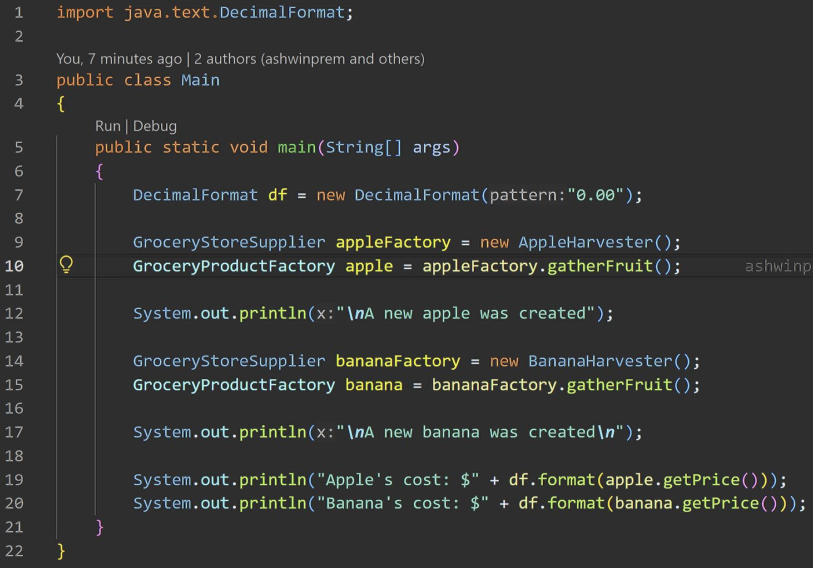
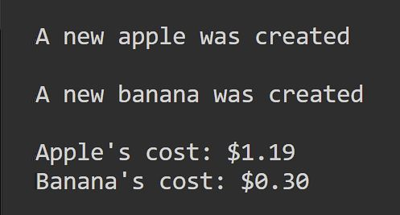
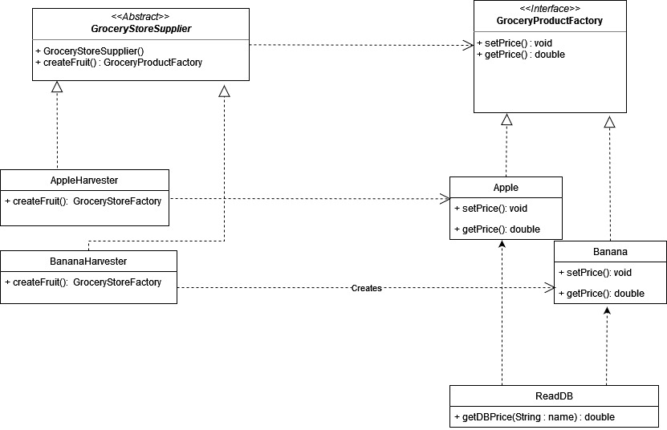

<div align="center">
<hr>

# SOFE3650 - Assignment #1

<ins>**Implementations of Abstract Factory Pattern and Factory Method Pattern (UML, Java)**</ins>

<ins>*Wednesday, September 27, 2023*</ins>

*Assign. Exercise Gp. 6:*

|Name|Student #|
|:---:|:---:|
|Noah Toma|100825559|
|Verina Bouls|100789655|
|Ashwin Prem|100805031|

</div>
<br>

<div align="center">

## Structure

This repository contains all submission files as per the requirements outlined in the assignment.

The main directory features both subdirectories and files.  The first subdirectory contains the Java source code, and is labeled [Design Patterns](./Design%20Patterns/).  The second subdirectory includes all image files that depict the output of the Java implementation, and is labeled [Output](./Output/).  The third subdirectory is titled [UML](./UML/), and contains both a [PNG](./UML/UML.png) and [JPEG](./UML/UML.jpeg) image file depicting the completed UML diagram of the design pattern architecture.  The files contained in the main directory include this Markdown document (titled [README.md](./README.md)), the rubric provided for this assignment (titled [Assign1-Design Patterns.pdf](./Assign1-Design%20Patterns.pdf)), and a [.gitignore](./.gitignore) file to prevent unnecessary file commits.

[Design Patterns](./Design%20Patterns/) contains all necessary project files, including all necessary '.java' and '.txt' source code files within subdirectory [src](./Design%20Patterns/src/).  The other subdirectory in this folder is labeled [Test](./Design%20Patterns/Test/), and includes a test file ([Main.java](./Design%20Patterns/Test/Main.java)) that serves as a means of analyzing the Java implementation by providing meaningful output.  This output, as well as the code itself, is captured in this document, as well as in the [Output](./Output/) folder.

</div>
<br>

<div align="center">

## Source Code + Output

<details>
  <summary>Open/Close</summary>
  
  |*Main.java*: Source Code|*Main.java*: Output|
  |:---:|:---:|
  |||
  
  <ins>*Source Code as Text:*</ins>
  
  <div align="left">

  ```
  import java.text.DecimalFormat;
  
  public class Main 
  {
    public static void main(String[] args)
    {
        DecimalFormat df = new DecimalFormat("0.00");

        GroceryStoreSupplier appleFactory = new AppleHarvester();
        GroceryProductFactory apple = appleFactory.gatherFruit();

        System.out.println("\nA new apple was created");

        GroceryStoreSupplier bananaFactory = new BananaHarvester();
        GroceryProductFactory banana = bananaFactory.gatherFruit();

        System.out.println("\nA new banana was created\n");

        System.out.println("Apple's cost: $" + df.format(apple.getPrice()));
        System.out.println("Banana's cost: $" + df.format(banana.getPrice()));
    }
  }
```

</div>

<br>

## UML Diagram:



</details>

</div>
<br>

<div align="center">

## Description of [Main.java](./Design%20Patterns/Test/Main.java)

First, the file imports the `DecimalFormat` library, for the purposes of formatting float output.  Then, the `Main` class is instantiated and populated with a standard *'PSVM' method* (`public static void main(String[] args)`), which takes an array of Strings as an argument.  

In this method, a `DecimalFormat` object is instantiated.  Next, a `GroceryStoreSupplier` object is instantiated with an `AppleHarvester` constructor and is followed by a `GroceryProductFactory` object that is instantiated with the value returned by the function `appleFactory.gatherFruit()`, which is an `Apple` object with a price set by the value read from [DB.txt](./Design%20Patterns/src/DB.txt).  The `Apple` object (which follows a 'Factory Method' pattern inherited from `GroceryProductFactory`) reads the price value stored in the database, stores it, and is returned via the `AppleHarvester` object, which inherits from the `GroceryStoreSupplier` 'Abstract Factory'.  Thus, `apple` is an `Apple` object (which itself is a factory method) returned by an abstract factory (`GroceryStoreSupplier`'s `gatherFruit()` method).  If the database was queried without error and the object was succcessfully instantiated, then a message stating that a new `Apple` has been created is printed to the screen.  The *exact* same logic applies to the `Banana` object, only involving its respective classes/factory patterns instead for the purposes of distinction.

Finally, to demonstrate that the program has functioned as intended (i.e., the factories successfully produced respective objects and the database was read without error), the costs of `Apple` and `Banana` are printed to the screen with formatting.

</div>

<hr>