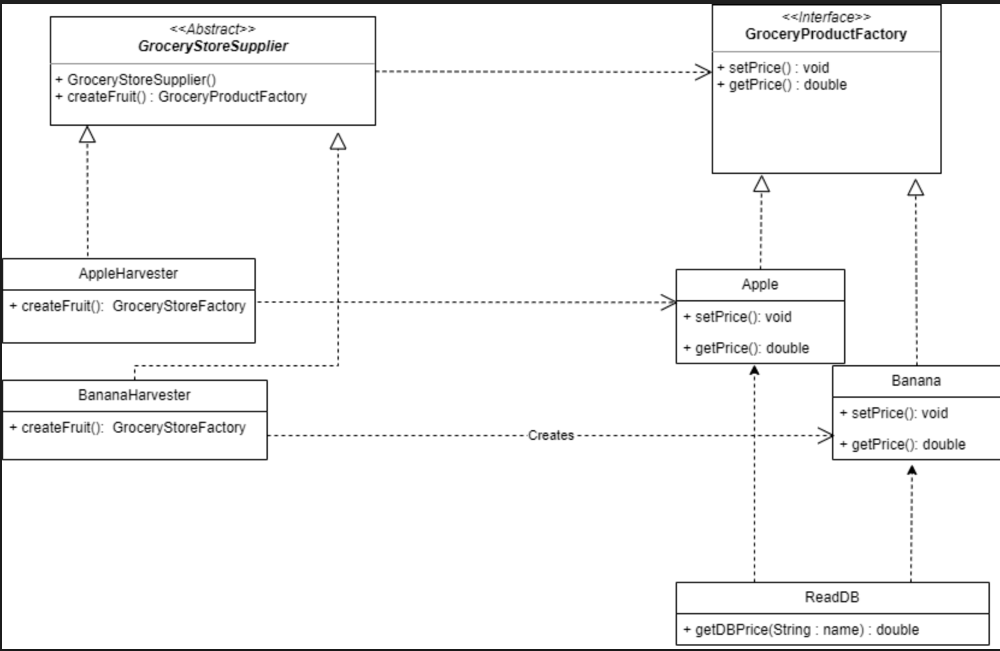
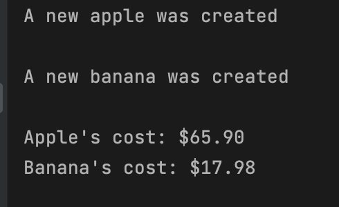

# SOFE_3650_Assignment1

# Summary

Demonstrate the use of an Abstract Factory Pattern and Factory Method Pattern by implementing java code that creates a various grocery products (object) for a grocery store. After the products have been created, read a database (which is just a text file in the same src folder) and assign the respective produce with their associated prices. A UML diagram was initiated first to set the foundation before implementing it in Java.

# **Group Members**

Verina Bouls (100789566)
Ashwin Prem (100805031)
Noah Toma ( )

Assign Exercise Gp. 6

# What is in the repo?

1. README.md file.
2. Folder called _Design Patterns_ that contains subfolders for both the source and test files.
3. A copy of the assignment document
4. The UML diagram

# UML Diagram

# Test Methods

To demonstrate how an object can be created, objects _appleFactory_ and _bananaFactory_ are created that are of type _GroceryStoreSupplier_. Then the actual produce (ie. apple and/or banana) are created that are of type _GroceryProductFactory_ by using the _gatherFruit()_ method. The price of each product is set when the objects get created, and can be retried via the _getPrice()_ method.

